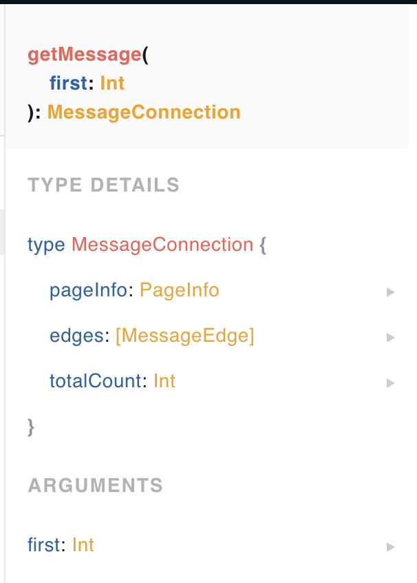

# Play GraphQL

This server is build by `express`, `apollo-server`, `apollo-server-express`

## Start you local GraphQL Dashboard

```
$ cd graphQL-server/

$ yarn run start

// or

$ ./pm2 start pm2_app.json // Will start GraphQL server.
```

On [http://localhost:4000](http://localhost:4000/graphql) you can see the GraphQL dashboard.


On the right bar we can see `Schema`:


Which we can go through all schema and see query rule and expect response data type and defined.

Lets see one example `getMessage`



Leave term which has `connection`, `edge` prefix in `getMessage` until next chapter to explain,
here give a simple ideal that `connection` is a `meta` data describe relation between two node.

Keep looking at `getMessage`:

- Before colon is field name and arguments with type.
- After colon is return type.
- Click on the return type, we can see response field we can get.
	
	- We focus on `edges`, it's a array object, which will return an array of `MessageEdge` object. When click on it and we can see more detail.
		- Here we have `node`, `cursor`
		- Click on `node`, we can see `Message` object which have `id`, `content` and `author`, for those information we can build our query object below:

Query

```
query {
  getMessage {
    edges {
      node {
        id
        author
        content
      }
    }
  }
}
```

Response

```
{
  "data": {
    "getMessage": {
      "edges": [
        {
          "node": {
            "id": "1532c0dc095890cf8dfb",
            "author": "Davis",
            "content": "init content1"
          }
        },
        {
          "node": {
            "id": "9697eaf5c6c4fd87f861",
            "author": "Davis",
            "content": "init content2"
          }
        },
        {
          "node": {
            "id": "0fce6185f06d6e039351",
            "author": "Davis",
            "content": "init content3"
          }
        },
        {
          "node": {
            "id": "4e2ec19f9d3ff332b6fe",
            "author": "Davis",
            "content": "init content4"
          }
        },
        {
          "node": {
            "id": "b2caa984f94e250675bd",
            "author": "Davis",
            "content": "init content5"
          }
        },
        {
          "node": {
            "id": "26cf0fdc77dbc1acb98d",
            "author": "Davis",
            "content": "init content6"
          }
        },
        {
          "node": {
            "id": "8ab3ef7d553c81a65460",
            "author": "Davis",
            "content": "init content7"
          }
        }
      ]
    }
  }
}
```

## Try

When you try to typing anything on query field, GraphQL dashboard will prompt you about what kind of field can use.


Please try to get different information!

Next we will talk about implement in really JS.

