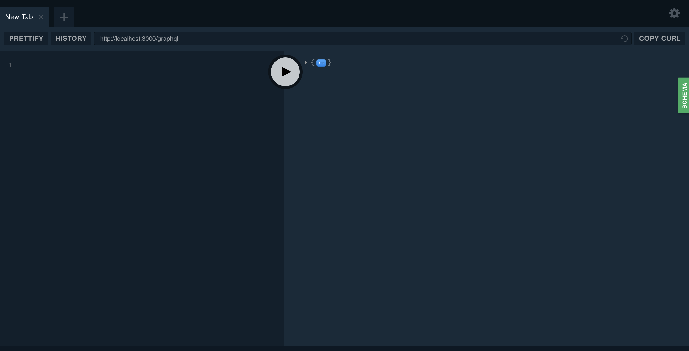
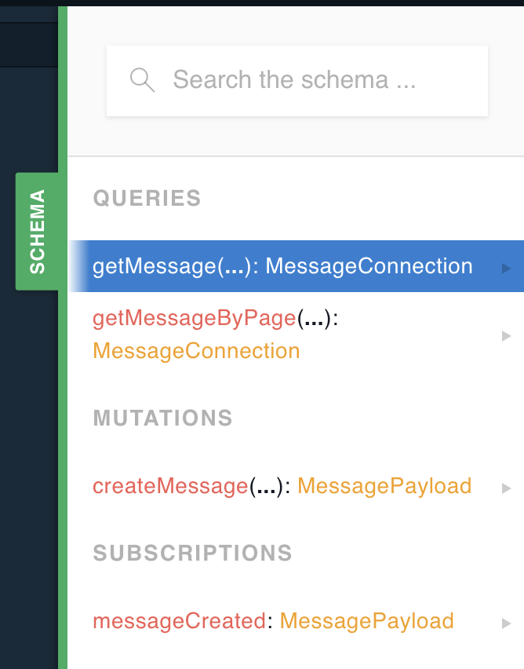
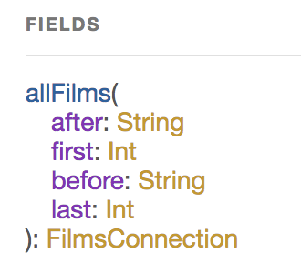
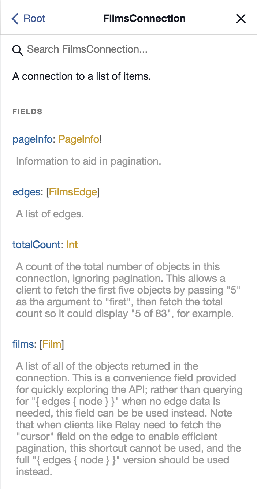
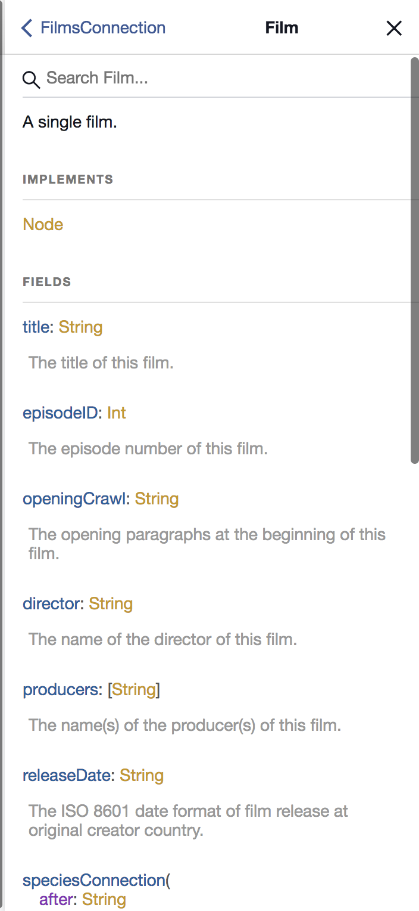
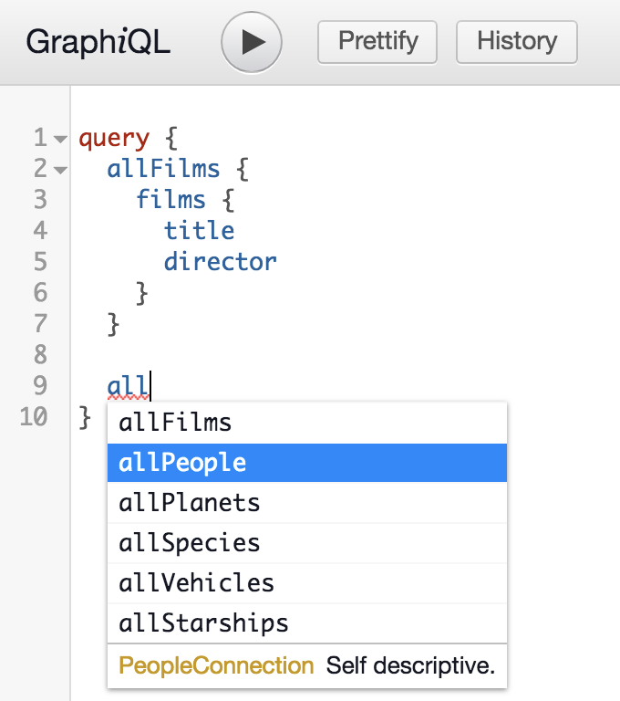

# Play with Star wars GraphQL ?

[Star wars GraphQL API](https://github.com/graphql/swapi-graphql) is based on [Star wars REST API](https://swapi.co/),
which is GraphQL Gateway with cache and build by NodeJS.

For more detail, check the link and fork on github.

## Start you local GraphQL Dashboard

```
$ cd swapi-graphql/

$ yarn run start

// or

$ ./pm2 start pm2_app.json // Will start all web server and GraphQL server.
```

On [http://localhost:5000](http://localhost:5000) you can see the GraphQL dashboard.



On the right bar we can see `Documentation explorer`:



Which we can go through all schema and see query rule and expect response data type and defined.

Lets see one example `allFilms`





Leave term which has `connection` prefix and those arguments for `allFilms` until `Relay` to explain more detail,
here simple explain about `connection` is a `meta` data describe relation between two node.

Keep looking at `allFilms`:

- Before colon is field name and arguments with type.
- After colon is return type.
- Click on the return type, we can see response field we can get.
	
	- We focus on `Film`, it's a array object, which will return an array of film object. When click on it and we can see more detail.
		- Here we have `title`, `episodeID`...etc, which we can build a query object as below:

Query

```
query {
  allFilms {
    films {
      title
      director
    }
  }
}
```

Response

```
{
  "data": {
    "allFilms": {
      "films": [
        {
          "title": "A New Hope",
          "director": "George Lucas"
        },
        {
          "title": "The Empire Strikes Back",
          "director": "Irvin Kershner"
        },
        {
          "title": "Return of the Jedi",
          "director": "Richard Marquand"
        },
        {
          "title": "The Phantom Menace",
          "director": "George Lucas"
        },
        {
          "title": "Attack of the Clones",
          "director": "George Lucas"
        },
        {
          "title": "Revenge of the Sith",
          "director": "George Lucas"
        },
        {
          "title": "The Force Awakens",
          "director": "J. J. Abrams"
        }
      ]
    }
  }
}
```

## Try

When you try to typing anything on query field, GraphQL dashboard will prompt you about what kind of field can use.



Please try to get different information!

Next we will talk about implement in really JS.

