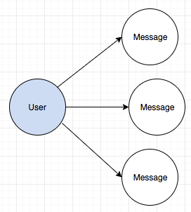
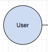
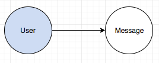
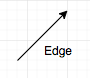

# Before play with framework

Before we start to implementate GraphQL Client side, let's talk about basic Graphql ideal and server side design first.

## GraphQL server side

In this section, we will take a look on our GraphQL server.

### Schema

```
var typeDefs = gql`
  type User {
    id: ID!
    name: String
    messageConnection: MessageConnection
  }

  type Message {
    id: ID!
    content: String
    author: String
  }

  type MessagePayload {
    messageEdge: MessageEdge
  }

  input MessageInput {
    content: String
    author: String
  }

  type PageInfo {
    startCursor: String
    endCursor: String
    hasNextPage: Boolean!
    hasPreviousPage: Boolean!
  }

  type MessageConnection {
    pageInfo: PageInfo
    edges: [MessageEdge]
    totalCount: Int
  }

  type MessageEdge {
    node: Message
    cursor: String
  }

  type Query {
    getMessage(first: Int): MessageConnection
    getMessageByPage(first: Int, after: String, last: Int, before: String): MessageConnection
    getUserMessages(first: Int, after: String): User
  }

  type Mutation {
    createMessage(input: MessageInput): MessagePayload
  }

  type Subscription {
    messageCreated: MessagePayload
  }
`
```

This schema following cursored base which is best practice in GraphQL to support not only pagination but also subscription. Also even is not required, but if we want to implement `Relay` and use it's own api, cursored base is the only thing work.

### Problem we have

There are two design are famous for pagination, page/offset base and cursored base, cursored base is use in every where like Github GraphQL api, Spotify GraphQL api...etc, it comes from [Relay Cursored Base Spec](https://facebook.github.io/relay/graphql/connections.htm)
.

But before we jump into Cursored Base, let's take a look how offset base deal with pagination:

```
getPostsByPage(limit: 4, offset: 0, (results) => {
	// Get posts from id: 1 ~ id: 4
	...
})

getPostsByPage(limit: 4, offset: 4, (results) => {
	// Get posts from id: 5 ~ id: 8
	...
})
```

Offset base is intuition and easy to implement, for stable data should work fine, but during this age, streaming/live data is mainstream, offset base will face problem below:

 - DB operation spend a lot of time of offset is getting bigger
 - Offset base cannot deal with data add/delete during change the page:
	- Suppose page 1 is `id: 1 ~ id: 4`, if someone delete `id: 1` during you change the page, page 2 will get `id: 6 ~ id: 9` instead of `id: 5 ~ id: 8`

 
 
Cursored base is very useful for this kind of case:

```
getPostsByPage(first: 4, after: "0" (results) => {
	// Get posts after id: 0, so return id: 1 ~ id: 4
	...
})

// Someone delete id: 1 during you change.

getPostsByPage(first: 4, after: "4", (results) => {
	// Get posts from id: 5 ~ id: 8 even id: 1 is been delete, because we asking posts after id: 4
	...
})
```
### Cursored base

Now let's take a look cursored base, first need to explain some vocabulary.

Imagine one User might have multiple messages, so we get this graph:



`User`, `Message` both are `Node`, have `id` and it's own attributes(`name`, `author`, `content`...etc).



```
type User {
	id: ID!
	name: String
	messageConnection: MessageConnection
}

type Message {
    id: ID!
    content: String
    author: String
}
```

`MessageConnection` is an abstract concept, which is a `meta` data to describe relation with message, store pagination information and total count.



```
type MessageConnection {
    pageInfo: PageInfo
    edges: [MessageEdge]
    totalCount: Int
}
```

`MessageEdge` is the real connect between two node.



```
type MessageEdge {
    node: Message
    cursor: String
}
```

`node` is the arrow pointing node, `cursor` is an ID for edge.

Another type is call `Payload` like `MessagePayload`, it's callback data structure for `subscribe` and `mutation`.

With this design, it's easy understand relation between two node.

## Summary

Base on this introduction, we know things that GraphQL try to resolve, of course we don't really need to follow this design and treat it just a new way to communicate between client and sever side, for only query still work, but once we want to enhance to pagination feature, this graph design will show the benefit.<del>And unfortunately, Relay api only support this design so far...</del>

Next Chapter will started to implement client side.

# Reference

- [https://blog.apollographql.com/explaining-graphql-connections-c48b7c3d6976](https://blog.apollographql.com/explaining-graphql-connections-c48b7c3d6976)
- [https://ithelp.ithome.com.tw/articles/10207738](https://ithelp.ithome.com.tw/articles/10207738)


