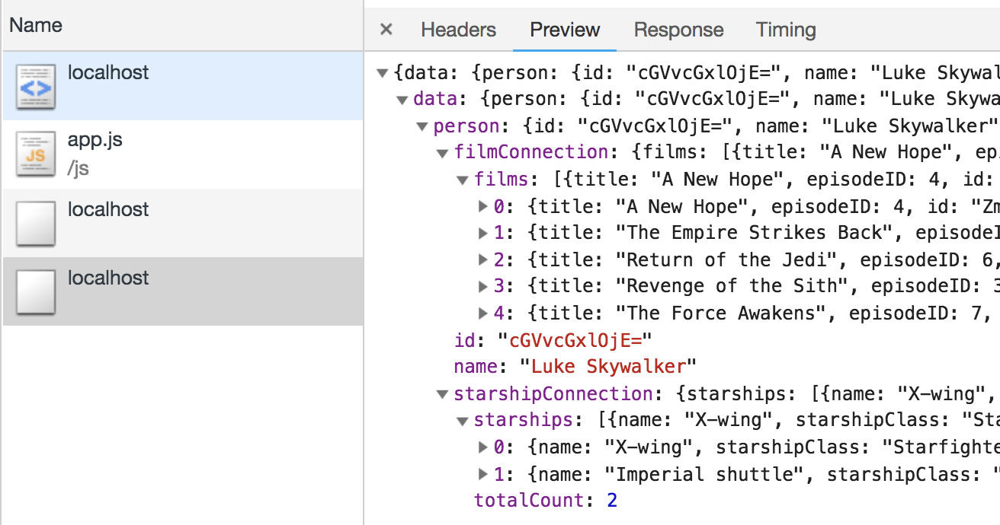
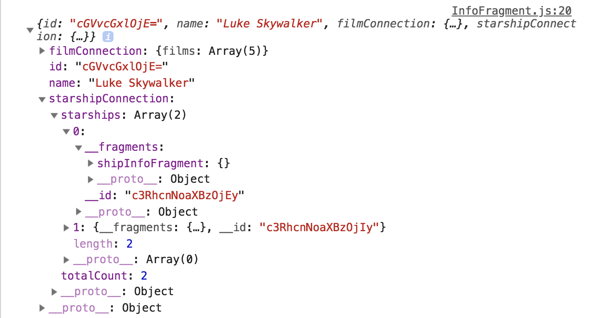

# Relay

For this tutorial, we will use `Relay (modern)` to get Star Wars info.

## Overview

1. [Introduction of Relay](#Introduction)
2. [Preparation](#preparation)
3. [Look to the code](#start-development)
4. [Pratice](#pratice)
5. [Unit Test](#unit-test)

## Introduction

Relay is a framework build by Facebook.
In the introduction, Relay is data-driven React component, not like Apollo support different platform, Relay focus on React and it's head of GraphQL development, most of new feature will implement on Relay at first.

Relay also allow component specify what kind of data it need only provide the data, which we can see more example in this tutorial.

## Preparation

Before started, Relay need strong type support, not like Apollo is a option, Relay is more strictly and so far only support `Flow`.

Same as previous tutorial, we need to download schema from server.

#### Launch GraphQL server

```
$ cd swapi-graphql && yarn run start
```

#### Get the sechma from server

Now we can get the sechma, `get-graphql-schema` support GraphQL type or JSON type, In this example we use graphql type.

```
$ yarn run get-schema-graphql
```
This command will generate a `schema.graphql` file under `src/`,
look deep into it you can see the type definition of each field.


#### Generated Flow type

After get the schema, we will use `relay-compiler` command to generated Flow type base on our query.

Query file is under `src/component/queries/*.js`.

Remember we introduce `Fragment` in [2.3 - Terminologies](../../graphql/terminologies.md), here we defined query schema by using fragment, so `relay-compiler` will generate each fragment type, we will explain why using fragment in this example.

Run command

```
$ yarn run type
```

Look deep into this command

```
relay-compiler --src ./src/component/ --schema ./schema.graphql
```

`compiler` will grab queries in `--src` and generate type.

`--schema` is the schema we got from server side.

`relay-compiler` will put the generated type files under `__generated__`, each file not only describe the type but also show the AST.

#### Start Relay

```
$ cd starwars-relay && yarn run start
```

Webpack dev server will run on [http://localhost:3002](http://localhost:3002)

## Look to the code

### Target

Make a input field for input personID as query variable,
fetch person info and show on component.

Same as previous section.

### Main component

#### src/component/Root.js

```
const PersonQuery = searchStyle((props) => {
  const { classes } = props
  return (
    <QueryRenderer
      environment={modernEnvironment}
      query={personQuery}
      variables={{personID: props.personID}}
      render={({error, props}) => {
        if (error) {
          return <Paper className={classes.infoPaper}><div>Error</div></Paper>
        }
        if (props && props.person) {
          return <InfoFragment data={props.person}/>
        } else {
          return <Paper className={classes.infoPaper}><div>Loading</div></Paper>
        }
      }}
    />
  )
})
```

In `src/component/Root.js`, we import `QueryRenderer` from `react-relay`,
`QueryRenderer` will fetch the data when component mount time.

`QueryRenderer` need setting parameters `environment`, `variables` and `query` schema.

`environment` is set in `src/env.js`.

#### src/env.js

```
import { Environment, Network, RecordSource, Store } from 'relay-runtime'
import 'whatwg-fetch'

function fetchQuery(operation, variables) {
  return fetch('http://localhost:5000/', {
    method: 'POST',
    headers: {
      'Content-Type': 'application/json',
    },
    body: JSON.stringify({
      query: operation.text,
      variables,
    }),
  }).then(response => {
    return response.json()
  })
}

export const modernEnvironment = new Environment({
  network: Network.create(fetchQuery),
  store: new Store(new RecordSource()),
})
```

There are serveral way to implementation network layer in `Relay`,
here we use facebook isomorphic fetch `whatwg-fetch` and create a `Store` object as cache.

`operation.text`, `variables` are query schema and variables we set in `QueryRender`.
Once component mount, will get the data in props.

Pass data to child component `InfoFragment`.

#### src/component/InfoFragment.js

```
import React from 'react'
import Paper from '@material-ui/core/Paper';
import { createFragmentContainer } from 'react-relay'
import ShipFragment from './ShipFragment'
import { Info as InfoQuery } from '../queries/info'
import { searchStyle } from '../util/style'

const Info = searchStyle((props) => {
  const { classes, data: person } = props

  return (
    <Paper className={classes.infoPaper}>
      <div>{person.name}</div>
      <ul>
        {person.starshipConnection && person.starshipConnection.starships
          ? person.starshipConnection.starships.map((starShip, starShipIndex) => {
            return <ShipFragment key={`starShip-${starShipIndex}`} data={starShip}/>
          })
          : null
        }
      </ul>
    </Paper>
  )
})

export default createFragmentContainer(
  Info,
  InfoQuery,
)
```

Start from here is the most different part between Apollo,
at beginning we import `createFragmentContainer` from `react-relay`.

Constructor of `createFragmentContainer` needs a `component` for using GraphQL fragment data and `fragmentSpec` is specifies the data requirements for the Component via a GraphQL fragment, the required data will be available on the component as props that match the shape of the provided fragment.

`createFragmentContainer` not directly fetch the data, but will make sure data exist or not before render.

For more detail, please check reference [here](https://facebook.github.io/relay/docs/en/fragment-container.html).

`Info` is the stateless component above,
`InfoQuery` is the fragment spec.

#### src/queries/info.js

```
import { graphql } from 'react-relay';

export const Info = graphql`
  fragment infoFragment on Person {
    id
    name
    filmConnection {
      films {
        title
        episodeID
      }
    }
    starshipConnection {
      starships {
        ...shipInfoFragment
      }
      totalCount
    }
  }
`
```

if we print out the data (here rename to person by ES6 Syntactic sugar) in component and compare the network console, we can see what's different between Relay and Apollo.

In network console, all data has been fetch as image:



But in `Info` component, you can only get data specifies in fragment spec, like `shipInfoFragment` is an empty object, this is because Relay masking data inside `shipInfoFragment` due to itx describe in other fragment spec.



Pass `starShip` to `ShipFragment`.

#### src/component/ShipFragment.js

```
import React from 'react'
import { createFragmentContainer } from 'react-relay'
import { ShipInfo as ShipInfoQuery } from '../queries/shipInfo'

const ShipInfo = (props) => {
  const shipInfo = props.data
  return <li>{shipInfo.name}</li>
}

export default createFragmentContainer(
  ShipInfo,
  ShipInfoQuery,
)
```

Same as `Info` component, `ShipInfo` is stateless component and `ShipInfoQuery` is specify spec.

### Input Field Component

Same as previous tutorial, click button and change the props to re-fetch new data.

### Summary

Relay core thinking is *declarative component*, which means each component describe what kind of data it needs and show on UI.

Relay decrease component coupling via only can access the data specify in spec, even child component.

For more detail, please check [document](https://facebook.github.io/relay/docs/en/thinking-in-relay.html).

## Pratice

Like previous pratice,
please try to fetch more information by update schema and create more fragment,
don't forget re-generate the type.

## Unit test

In the section, we need some step to setup and target what kind of unit test we need to wirte.

### Setup

Same as pervious tutorial, we use `jest` and `enzyme` as unit test tool, 

```
"scripts": {
    ...
    "test": "node scripts/test.js --env=jsdom",
```

Command set `--env` as `jsdom` and in `scripts/test.js` run `jest` as global variable.

Seems this Application use Apollo Client Query to do GraphQL fetch,
there are some topic we can test:

- When component mount, Query component really do fetch and render the component.
- `spyOn` apollo client object and make sure the fetch method really tigger.
- The `query` which apollo client send is same as what we expect.
- Component render element from mock response.

Due to above reason, we need to do some setup to make unit test work.

- `test/setup.ts` is setting up `enzyme-adapter-react-16`.
- `test/client-mock.ts` is making a fake Apollo client by use `makeExecutableSchema`, define fake `sechma` and `resolvers` instead of request real GraphQL server.


### Testing

```
import * as React from 'react'
import { ApolloProvider } from 'react-apollo'
import { mount } from 'enzyme'

import '../../test/setup'

import clientMock from '../../test/client-mock'

import { GraphQLPerson } from './App'
import { SWPersonQUERY } from './queries'

describe('GraphQLPerson', () => {
  it('calls the query method on Apollo Client', () => {
    const clientMockSpy = jest.spyOn(clientMock, 'watchQuery');

    mount(
      <ApolloProvider client={clientMock}>
        <GraphQLPerson personID={'1'} />
      </ApolloProvider>,
    )

    expect(clientMockSpy).toHaveBeenCalled()
    expect(clientMockSpy.mock.calls[0][0].query).toEqual(SWPersonQUERY)
    clientMockSpy.mockRestore()
  })

  it('Render component', () => {
    const wrapper = mount(
      <ApolloProvider client={clientMock}>
        <GraphQLPerson personID={'1'} />
      </ApolloProvider>,
    )
    expect(wrapper.find('div').at(1).text()).toEqual('Luke Skywalker')
  })
})
```

Import `'../../test/setup'` for setting `Jest` as global variable, `Jest` provide `BDD`/`TDD` method so we don't need to include other library.

`clientMock` is the mock client for `ApolloProvider`, which `Query` will go through this mock client.

First test is to check component really call the query method and the query is what we expected when component mount.
`spyOn` will monitoring the `clientMock` method, all query will go with `watchQuery` method in `clientMock`(Jump into `ApolloClient.d.ts`, there are all method type definition. `watchQuery` not just use in one query but also query and mutation, for more detail please check here [watchQuery vs query](https://github.com/Akryum/vue-apollo/issues/1)).

`expect` the spy object has been call once.
Also this object provide a mock instance for access to the mock's metadata, grab the query we send and compare the is it same as the query `SWPersonQUERY` we setting in component.

Second is make sure component really render element, the element value should same as our mock data.

## Reference
- [Apollo client testing](https://www.apollographql.com/docs/react/recipes/testing.html)
- [react-apollo-client-testing](https://www.robinwieruch.de/react-apollo-client-testing/)
- [testing-apollos-query-component](https://blog.apollographql.com/testing-apollos-query-component-d575dc642e04)
- [relay-vs-apollo](https://www.prisma.io/blog/relay-vs-apollo-comparing-graphql-clients-for-react-apps-b40af58c1534)

